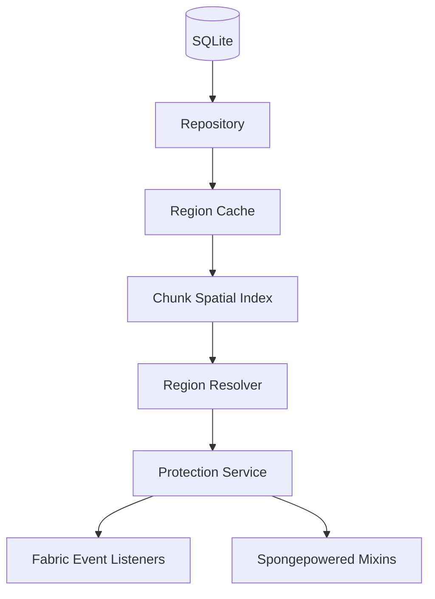

# Arquitetura do Mod

O **BigBang Regions** é projetado como uma base desacoplada e independente. A proteção territorial é resolvida de maneira modular, onde cada camada possui uma responsabilidade única.

## Descrição das Camadas

1. **Persistência (SQLite)**:
   * Localizado em `config/bigbangregions/regions.db`.
   * Armazena definições das regiões, membros, flags e logs de auditoria.
   * Migrações de banco automáticas e versionadas localizadas nos recursos do mod.

2. **Repositório (Repository)**:
   * Abstração de acesso a dados SQL.
   * Isolamento total: queries SQL nunca são executadas na thread principal (hot path) de eventos do Minecraft.

3. **Cache de Regiões (RegionCache)**:
   * Mantém todas as regiões na memória para leitura instantânea.
   * Sincronizado com operações de inserção/deleção.

4. **Índice Espacial (ChunkSpatialIndex)**:
   * Indexa regiões por chaves de chunk (`dimensionKey + chunkX + chunkZ`).
   * Reduz drasticamente a quantidade de bounding boxes inspecionadas por ação do jogador.
   * Invalida de forma granular ao criar ou remover regiões.

5. **Resolvedor de Regiões (RegionResolver)**:
   * Executa a lógica de prioridades, volume e desempate determinístico para selecionar a região efetiva que cobre uma coordenada.

6. **Serviço de Proteção (ProtectionService)**:
   * Ponto central do motor de proteção.
   * Recebe um `ProtectionContext` (com dados da ação) e retorna um `ProtectionResult` com a decisão estruturada (ALLOW, DENY, NO_REGION, BYPASS).

7. **Eventos e Mixins (Protection Hooks)**:
   * Listeners do Fabric API interceptam a ação e consultam o `ProtectionService`.
   * Para áreas não cobertas por eventos, pequenos Mixins otimizados (como PvP e drop de itens) realizam a interceptação.
