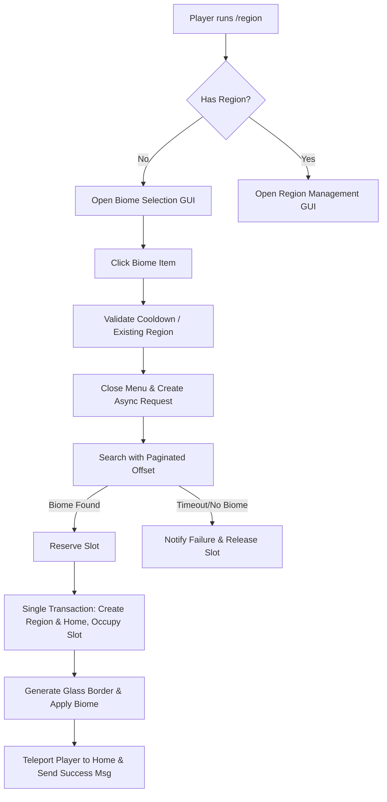

# Audit and Architecture: BigBangRegions Region Creation System

This document outlines the diagnosis of the previous region creation system, the root causes of its failure, the design of the new visual experience, and the implementation details of the security and boundary containment systems.

---

## 1. Estado Anterior (Previous State)

Previously, player region creation relied on a text command: `/regions criar <bioma>`.
- The creation process was entirely asynchronous, moving through states: `PENDING` -> `SEARCHING` -> `SLOT_RESERVED` -> `PREPARING` -> `REGION_CREATING` -> `COMPLETED`.
- The background scheduling ran every 5 ticks via `AllocationScheduler` on the server main thread.
- When an allocation finished successfully, the database transaction was committed, but there was **no user feedback, notifications, or automatic teleports** to the newly created area. The player had to manually check status and teleport using `/regions casa`.

---

## 2. Causa Raiz Encontrada (Root Cause of Failure)

During analysis of `TerrainAllocationCoordinator.java` and `PlotSlotService.java`, a critical design flaw was discovered:
1. **Stateless Stuck Loop**: In `TerrainAllocationCoordinator.java`, during the `SEARCHING` state:
   - It requested a list of eligible candidates using `slotService.getCandidates(ownerUuid, maxCandidates)`.
   - `PlotSlotService.getCandidates` generated candidate positions starting from the innermost grid rings, shuffling them using `ownerUuid` as a seed for the randomizer to ensure a deterministic coordinate order for the player.
   - If none of these `maxCandidates` matched the player's requested biome option, the tick process returned `0` (indicating nothing was processed) and kept the request in `SEARCHING` state.
   - On the next tick, the coordinator called `getCandidates` again. Because the search was stateless and used the same `ownerUuid` seed, **it generated the exact same coordinates and checked the exact same biomes, failing again**.
   - The coordinator became stuck in the `SEARCHING` state forever, spamming checks on the same non-matching coords without ever expanding the search radius.
2. **Missing `/region` Command**: There was no direct `/region` command registered; players had to use `/regions` subcommands.
3. **No GUI Interface**: There was no visual inventory menu (GUI) to select biomes or manage regions.
4. **Lack of Boundary Containment**: There was no server-side enforcement to prevent players from moving, flying, or teleporting out of their regions.
5. **No Glass Border Generation/Protection**: Glass walls/borders were not generated or protected against breaking, placement, explosions, or pistons.

---

## 3. Fluxo Novo (New Flow)

The new region creation and management flow is fully visual, secure, and transactional:



### Biome Selection Menu (Chest GUI)
- Generic 9x3 chest GUI entitled `§8Escolha o bioma do seu terreno`.
- Populated with biomes configured in the config file, using representative item icons (e.g., Grass block for plains, Oak log for forest, Spruce log for taiga, etc.).
- Decorative gray stained-glass panes fill empty slots.
- Direct inventory clicks are intercepted and cancelled server-side to prevent item theft/duplication.

### Management Menu (Chest GUI)
- If the player already owns or is a member of a region, `/region` opens a menu with options:
  - **Ir para meu terreno** (Teleport to home spawn)
  - **Ver informações** (In-game region boundaries/info printed to chat)
  - **Gerenciar membros** (Shows list of members and commands in chat)

---

## 4. Estrutura de Dados (Data Structure)

The existing SQLite schema remains compatible to preserve user data. To support full customization, we add properties to `Config.java` to configure biome icons and border options:

```json
{
  "playerLandAllocation": {
    "border": {
      "material": "minecraft:glass",
      "thickness": 1,
      "protect": true,
      "createCeiling": false
    }
  }
}
```

We also configure each biome's item icon in `biomeOptions` (e.g. `"icon": "minecraft:grass_block"`).

---

## 5. Proteções Implementadas (Protections Implemented)

### Lateral and Top Containment (WorldBorder)
- Enforced server-side during the player's tick.
- If a player is in the target terrain dimension and is associated with a region:
  - We verify if they are within their region bounds OR inside the public exploration zone.
  - If they cross outside, they are instantly teleported back to their `lastSafePosition` (or the region home spawn), their velocity is reset to `0` (preventing momentum bypasses and fall damage), and they receive a warning: `§cVocê chegou ao limite do seu terreno.` (with a 2-second spam cooldown).
  - Admins with `bigbangregions.bypass.boundary` are exempt.

### Glass Border Generation and Protection
- Lateral glass walls are built from the minimum height to the maximum height along the bounds.
- Block place/break, bucket usage, and entity interactions on the boundary blocks are blocked.
- **Piston Protection**: A mixin in `PistonStructureResolver` detects if any block being pushed or pulled lies on a region boundary, or if a block moves across region borders. If so, the piston action is cancelled.
- **Explosion Protection**: A mixin in `Explosion` intercepts blocks about to be destroyed, removing any region boundary blocks and blocks inside protected regions (unless allowed by flags) from the `toBlow` list.

---

## 6. Estratégia de Rollback (Rollback Strategy)

All changes performed during the final region creation phase (`REGION_CREATING`) are executed inside a single SQLite transaction:
1. Insert the region data and set its initial active status.
2. Insert member records (owner as OWNER).
3. Update the plot slot state to `OCCUPIED` and associate it with the region ID.
4. Attempt to find a safe spawn position. If none is found, the transaction is **rolled back**, the database remains clean, and the request transitions to `FAILED_NO_TERRAIN`.
5. Insert the home coordinates.
6. Commit transaction.
7. Only after a successful commit, the visual glass borders are built in the level, and the player is teleported.
